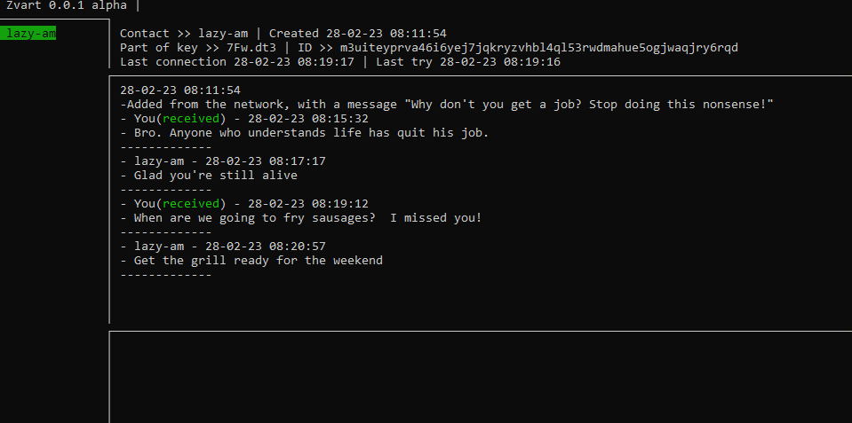

zvart
=====



## Idea

Create an easy-to-use tool that allows you use the tor network (and hopefully i2p) for private chatting

## Why is this needed?

Sadly, there is no easy-to-use way to privately messenger over the tor network. The nearest analogue [OnionShare](https://github.com/onionshare/onionshare) can not be used for this (chats there do not have any protection and will be compromised at the first open transfer link through a social network, the link to the chat is not saved between runs and much more problems). I don't know of any other programs that are similar, but if you do, please contact me.

## Privacy

All user data is encrypted in a file (user.zvart by default). Including the Ed25519 tor host key, all messages and contacts. No one will be able to read them until attackers gain access to your file system and brute force a password, so think of a good and long password, use full-disk encryption and other sensible measures.

## Project Status

The program is in the first alpha version. The protocol of exchange between clients
and the protocol of storing information in the database is likely to change.
Weak optimization of the database and network. Weak resistance to attacks.

### Under the hood.

* 3072-bit RSA used for user identification and session key encryption.
* 128-bit AES used for the session key and database file encryption
* [bbolt](https://github.com/etcd-io/bbolt) used for save data to file.
* [gocui](https://github.com/jroimartin/gocui) to display the console
* [bine](https://github.com/cretz/bine) for communicating with tor
* [oto](https://github.com/hajimehoshi/oto) for playing sounds

### Roadmap

* ~~Add sound effects to chat events~~
* Basic functions (delete contacts, change password)
* File transfer
* Make a multilingual interface
* Anti ddos protection
* Working via i2p in addition to tor
* Implement "channels." Informational chats in which only the author can write.
* Implement auto-updating
* Make an alternative user interface in the browser

### limitations

* A message over a tor network can take a long time (about one minute)
* The message can be sent only if your contact is online
* The program is hard to use at this stage, it takes a lot of time to finish the idea

## Getting Started

### Installing

Download and unpack the program build.
Run `zvart.exe` on Windows and `zvart` on Linux.

### Tor setup

If the Tor network is blocked in your country, you will need to set up bridges.
Open file `tor/torrc` and add the following lines to the end of the file

```
UseBridges 1
Bridge <>
Bridge <>
```

Instead of <> symbols, insert the bridge string obtained from the https://bridges.torproject.org/options/ website. Note that the current version does not support obfs4 bridges on linux.

### Sign up

At the first start-up, specify a name and password.

### How to contact someone in this program

After starting and connecting of tor (the two captions above will turn green) press `CTRL + I` . The link to your account will be copied to your computer's clipboard. You can share this link with your friends.

### Contact creation

If you know someone's link, you can create a contact by typing

```
:nc <> message
```

Instead of symbols `<>` insert a link (directly in the program use `CTRL + V` to paste from the clipboard), and instead of the word `message` you can write some kind of greeting. Then a contact will be created and an attempt will be made to connect to that account. After receiving a notification that you want to add him/her to your contact sheet, the person must reply to you with any message - this will complete the process of mutual connection and you can chatting.

### Console shortcuts
* `Сtrl + Q` - exit the program
* `Ctrl + Tilde` - exit the selected chat
* `Ctrl + I` - copy your Tor host to the clipboard
* `Ctrl + V` - paste information from the clipboard into the entry field
* `Mouse wheel` - scroll the chat
* `Mouse click on a contact` - select the chat

### Commands:

* `:nc {link} {message}` create a contact from a tor `{link}` with `{message}`

## How to help

* Translation - if you see errors in the translation of the interface or want to help translate the program into your language, then contact me in any way
* Programming - help with fixes and implementation of new features
* Promotion - if you like the idea of the program - share this program on social media.

## Contacts

* Mail LazyOnPascal@proton.me
* My zvart `shpqlr3cit4svvkvpsyoinfwc32y2jdwbq2jdfrccxtlcwresn63jaid`
