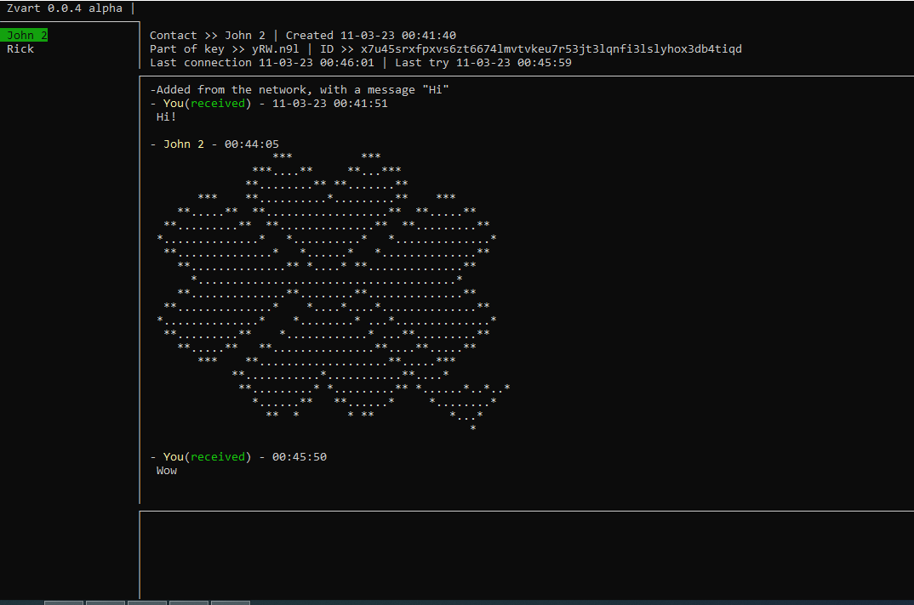

zvart
=====



## Idea

Create an easy-to-use tool to use the tor network for private, decentralized chatting

## Similar programs

[Cwtch](https://cwtch.im/download/)

## Privacy

All user data is encrypted in a file (user.zvart by default). Including the Ed25519 tor host key, all messages and contacts. No one will be able to read them until attackers gain access to your file system and brute force a password, so think of a good and long password, use full-disk encryption and other sensible measures.

## Project Status

The program is in the first alpha version. The protocol of exchange between clients
and the protocol of storing information in the database is likely to change.
Weak optimization of the database and network. Weak resistance to attacks.

### Under the hood.

* 3072-bit RSA used for user identification and session key encryption.
* 128-bit AES used for the session key and database file encryption
* [bbolt](https://github.com/etcd-io/bbolt) used for save data to file.
* [gocui](https://github.com/jroimartin/gocui) to display the console
* [bine](https://github.com/cretz/bine) for communicating with tor
* [oto](https://github.com/hajimehoshi/oto) for playing sounds

### Limitations

* A message over a tor network can take a long time (about one minute)
* The message can be sent only if your contact is online
* The program is hard to use at this stage, it takes a lot of time to finish the idea

## Getting Started

### Tor setup

The program contains a Tor that is up to date at the time of build. You can use your tor by passing its location via startup parameters (run zvart -h to read more)

If the Tor network is blocked in your country, you will need to set up bridges.
Open file `tor/torrc` and add the following lines to the end of the file

```
UseBridges 1
Bridge <>
Bridge <>
```

Instead of <> symbols, insert the bridge string obtained from the https://bridges.torproject.org/options/ website. Note that the current version of TOR that comes with the program does not support obfs4 bridging in linux.

### Installing

Download and unpack the program build.
On linux, make files `zvart` and `tor/tor/tor` executable. For example via the terminal in the root zvart folder:

```
chmod u+x ./zvart
chmod u+x ./tor/tor/tor
```

Run `zvart.exe` on Windows or on Linux type in console:

```
./zvart
```

### Sign up

At the first start-up, specify a name and password.

### How to contact someone in this program

After starting and connecting of tor (the two captions above will turn green) press `CTRL + I` . The link to your account will be copied to your computer's clipboard. You can share this link with your friends.

### Contact creation

If you know someone's link, you can create a contact by typing

```
:nc <> message
```

Instead of symbols `<>` insert a link (directly in the program use `CTRL + V` to paste from the clipboard), and instead of the word `message` you can write some kind of greeting. Then a contact will be created and an attempt will be made to connect to that account. After receiving a notification that you want to add him/her to your contact sheet, the person must reply to you with any message - this will complete the process of mutual connection and you can chatting.

### Console shortcuts
* `Сtrl + Q` - exit the program
* `Ctrl + Tilde` - exit the selected chat
* `Ctrl + I` - copy your Tor link to the clipboard
* `Ctrl + V` - paste information from the clipboard into the entry field
* `Mouse wheel` - scroll the chat
* `Mouse click on a contact` - select the chat

### Commands:

* `:nc {link} {message}` create a contact from a tor `{link}` with `{message}`
* `:clear` delete all messages in the selected chat room

## Building from source

In the simplest case on Windows

```go build -o zvart.exe cmd/zvartconsole/main.go```

On Linux

```go build -o zvart cmd/zvartconsole/main.go```

To build a debug version

```go build -gcflags=all="-N -l" -o zvart cmd/zvartconsole/main.go```

Your build will sometimes have the output of a Tor application in the strangest place. To remove this, create a `vendor` folder and in the `vendor/github.com/cretz/bine/process/process.go` file comment out line number 50 with the contents

```
//cmd.Stdout = os.Stdout
```

## Contacts

* Mail LazyOnPascal@proton.me
* My zvart `shpqlr3cit4svvkvpsyoinfwc32y2jdwbq2jdfrccxtlcwresn63jaid`
